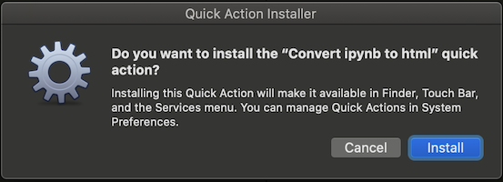

# FastJN

This repository contains some Automator scripts that make your life with Jupyter notebook much more efficient.

## How to use

Download or clone this project, you will find those weird folder-like files in **Scripts** folder are actually Automator scripts.  

Double-click on the script and click “install” button on the pop-up alert. it will automatically installed and a system preference window might show up to allow you to manage the actions. Just close it if you don’t want to do any further customization.

  

For example, if you installed _Open ipynb_, right-click on any “.ipynb” file, you will find “Open ipynb” in the “Quick Actions”.

All done👏.

> Those quick actions installed can be accessed by right-clicking menu on all types of files in Finder. So don’t do it on wrong file types or you will see an error.

## Content

1. Open ipynb
With this script installed, you can open any `ipynb` file by simply right-clicking file and selecting this item in the “Quick Actions”.

This action will open a new Terminal window that is running Jupyter notebook. So you need to manually close Jupyter notebook session with either of the following options when finished editing.   

- **Option1**  
Select the terminal window and press `Control+C` to end the session and `CMD+Q` to quit the terminal.  

- **Option2  
Select the terminal window and press `CMD+Q` and then click on `Terminate Process` button on popup alert.

2. Convert to html
This action will convert your `ipynb` to a html file. 
The new file wiil be in the same folder as your `ipynb` file.

3. Convert to pdf
This action will convert your `ipynb` to a pdf file. 
The new file wiil be in the same folder as your `ipynb` file.

> This script need package `pandoc`.  
Run `pip install pandoc` in your terminal if you see an error complaining `pandoc` not found.

